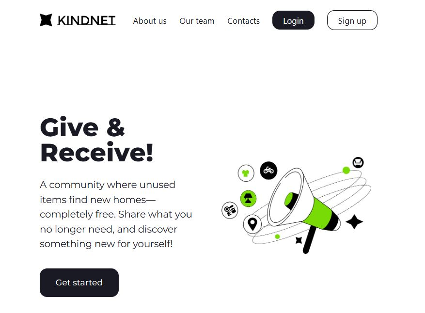
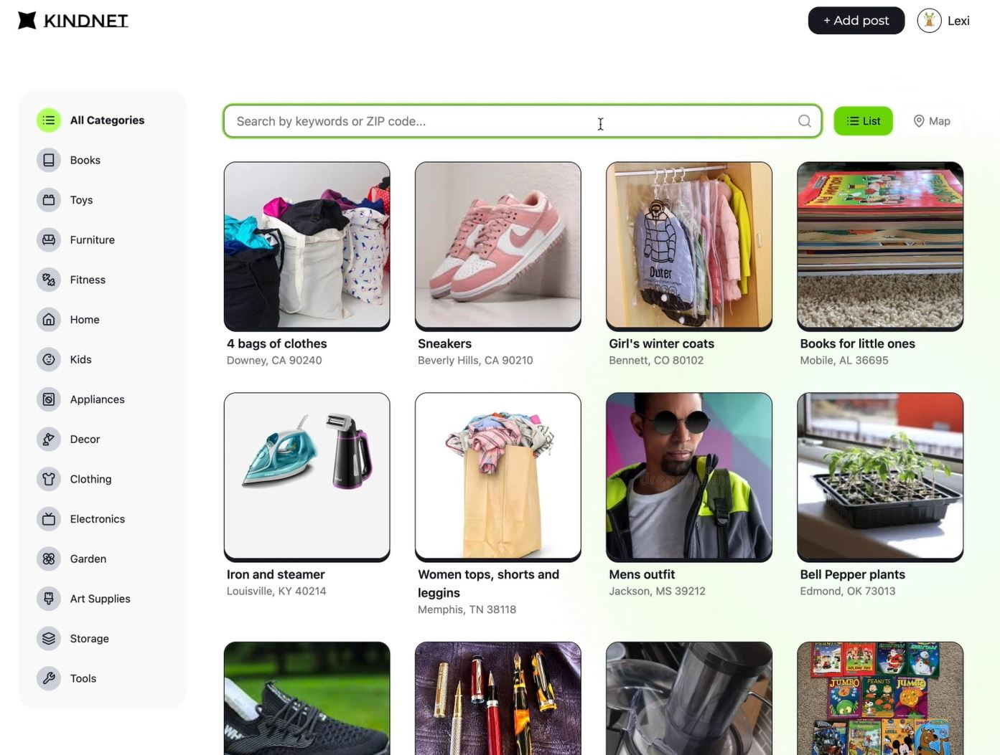
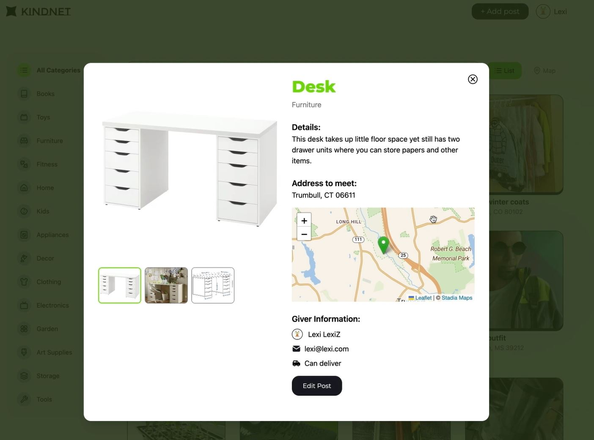
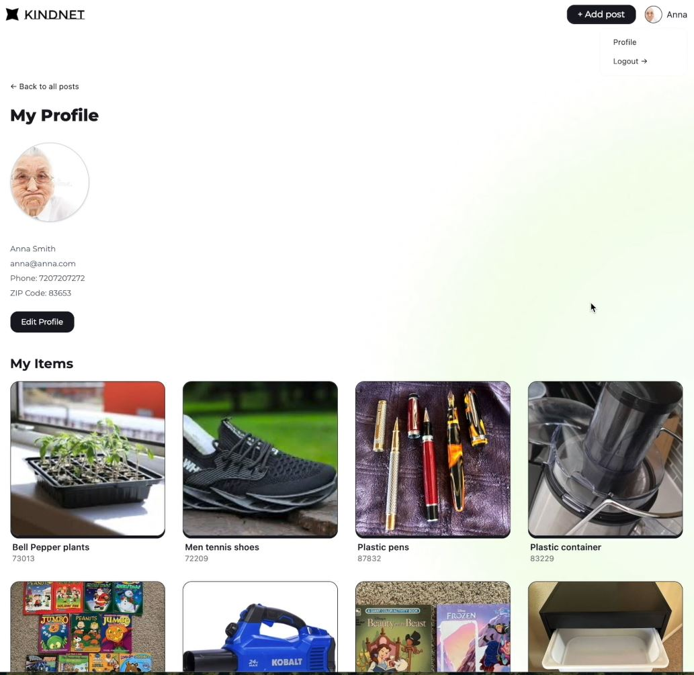

# Back-End Repo for Node/React Practicum

## 🖼️ Screenshots
### 🏠 Home Page

### 📦 Items Page

### 🔍 Single Item View

### 👤 User Profile

---

## 🧪 Test Credentials

You can explore the app using the following test user account:

- **Email:** test_user@example.com  
- **Password:** TestPassword123

---

### Setting up local development environment

1. Create a folder to contain both the front-end and back-end repos 
2. Clone this repository to that folder
3. Run `npm install` to install dependencies
4. Pull the latest version of the `main` branch (when needed)
5. Run `npm run dev` to start the development server
6. Open http://localhost:8000/api/v1/ with your browser to test.
7. Your back-end server is now running. You can now run the front-end app.

#### Running the back-end server in Visual Studio Code

Note: In the below example, the group's front-end repository was named `bb-practicum-team1-front` and the back-end repository was named `bb-practicum-team-1-back`. Your repository will have a different name, but the rest should look the same.

#### Testing the back-end server API in the browser

>Update the .node-version file to match the version of Node.js the **team** is using. This is used by Render.com to [deploy the app](https://render.com/docs/node-version).
